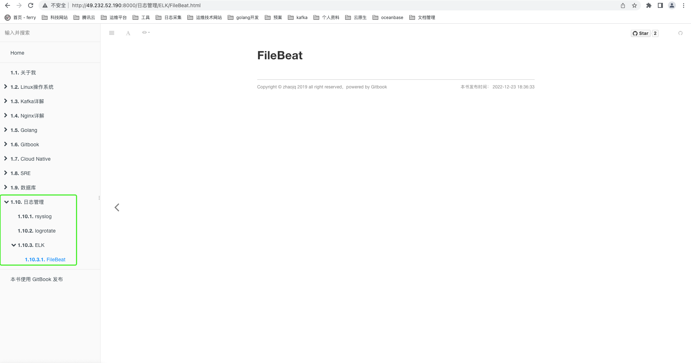

# 概述 


GitBook是一个基于 Node.js 的命令行工具，可使用 Github/Git 和 Markdown 来制作精美的电子书。

GitBook支持输出多种文档格式：
- 静态站点：GitBook默认输出该种格式，生成的静态站点可直接托管搭载Github Pages服务上；
- PDF：需要安装gitbook-pdf依赖；
- eBook：需要安装ebook-convert；
- 单HTML网页：支持将内容输出为单页的HTML，不过一般用在将电子书格式转换为PDF或eBook的中间过程；
- JSON：一般用于电子书的调试或元数据提取。


> 说明
> 使用GitBook制作电子书，必备两个文件：README.md和SUMMARY.md

# 安装部署
## 安装node及npm环境
```Shell
$ wget https://nodejs.org/dist/v12.16.1/node-v12.16.1-linux-x64.tar.xz
$ tar -xvf node-v12.16.1-linux-x64.tar.xz /usr/local/node
$ vim /etc/profile
export PATH=/usr/local/node/bin:$PATH
$ source /etc/profile
```

## 安装gitbook
```Shell
$ npm install -g gitbook-cli
```
安装完成后执行gitbook -V查看版本
```Shell
$ gitbook -V
CLI version: 2.3.2
GitBook version: 3.2.3
```

## 初始化
```Shell
$ gitbook init
```
gitbook初始化创建README.md和SUMMARY.md目录文件
- README.md是说明文档
- SUMMARY.md是书的章节目录

## 制定书籍章节目录
```
$ vim SUMMARY.md
# Summary

* [关于我](README.md)
* 日志管理
    * [rsyslog](日志管理/系统日志管理.md)
    * [logrotate](日志管理/日志切割.md)
    * [ELK](日志管理/日志采集分析工具.md)
        * [FileBeat](日志管理/ELK/FileBeat.md)
```
```
$ git init
info: create 日志管理/系统日志管理.md
info: create 日志管理/日志切割.md
info: create 日志管理/日志采集分析工具.md
info: create 日志管理/ELK/FileBeat.md
info: create SUMMARY.md
info: initialization is finished
```

## 启动服务
> 说明
> Gitbook默认端口为4000，可以通过--port指定端口

```
$ git serve --port 8000
Live reload server started on port: 35729
Press CTRL+C to quit ...

info: 43 plugins are installed
info: 26 explicitly listed
info: loading plugin "expandable-chapters"... OK
info: loading plugin "back-to-top-button"... OK
info: loading plugin "page-treeview"... OK
info: loading plugin "fontsettings"... OK
info: loading plugin "klipse"... OK
info: loading plugin "search-pro"... OK
info: loading plugin "favicon"... OK
info: loading plugin "pageview-count"... OK
info: loading plugin "code"... OK
info: loading plugin "auto-scroll-table"... OK
info: loading plugin "anchors"... OK
info: loading plugin "hide-element"... OK
info: loading plugin "advanced-emoji"... OK
info: loading plugin "tbfed-pagefooter"... OK
info: loading plugin "github"... OK
info: loading plugin "github-buttons"... OK
info: loading plugin "emphasize"... OK
info: loading plugin "splitter"... OK
info: loading plugin "sharing-plus"... OK
info: loading plugin "sectionx"... OK
info: loading plugin "simple-page-toc"... OK
info: loading plugin "alerts"... OK
info: loading plugin "click-reveal"... OK
info: loading plugin "accordion"... OK
info: loading plugin "theme-default"... OK
info: found 73 pages
info: found 2 asset files
warn: "options" property is deprecated, use config.get(key) instead
info: >> generation finished with success in 7.1s !

Starting server ...
Serving book on http://localhost:8000
(node:7863) [DEP0066] DeprecationWarning: OutgoingMessage.prototype._headers is deprecated
```

浏览器访问http://ip:8000即可。

