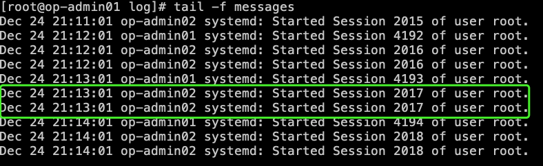

参考文档:[参考文档](https://blog.51cto.com/u_13236892/5637226)
# 概述
rsyslog是linux系统中用来实现日志功能的服务。默认已经安装，并且自动启用。

```
$  systemctl status rsyslog
● rsyslog.service - System Logging Service
   Loaded: loaded (/usr/lib/systemd/system/rsyslog.service; enabled; vendor preset: enabled)
   Active: active (running) since 五 2022-12-23 22:09:49 CST; 22h ago
     Docs: man:rsyslogd(8)
           http://www.rsyslog.com/doc/
 Main PID: 11528 (rsyslogd)
   CGroup: /system.slice/rsyslog.service
           └─11528 /usr/sbin/rsyslogd -n

12月 23 22:09:49 op-admin01 systemd[1]: Stopped System Logging Service.
12月 23 22:09:49 op-admin01 systemd[1]: Starting System Logging Service...
12月 23 22:09:49 op-admin01 rsyslogd[11528]:  [origin software="rsyslogd" swVersi...t
12月 23 22:09:49 op-admin01 systemd[1]: Started System Logging Service.
12月 24 05:38:34 op-admin01 rsyslogd[11528]: imjournal: journal reloaded... [v8.2...]
12月 24 06:14:36 op-admin01 rsyslogd[11528]: Framing Error in received TCP messag...]
12月 24 06:14:36 op-admin01 rsyslogd[11528]: Framing Error in received TCP messag...]
12月 24 06:14:37 op-admin01 rsyslogd[11528]: Framing Error in received TCP messag...]
12月 24 06:14:37 op-admin01 rsyslogd[11528]: Framing Error in received TCP messag...]
Hint: Some lines were ellipsized, use -l to show in full.
```
## 功能
主要用来采集日志，不生产日志。

## 特性
- 直接将日志写入到数据库。
- 日志队列（内存队列和磁盘队列）。
- 灵活的模板机制，可以得到多种输出格式。
- 插件式结构，多种多样的输入、输出模块。
- 可以把日志存放在Mysql ，PostgreSQL，Oracle等数据库中

## 日志采集实现
rsyslog提供了一种从客户端节点到单个中央服务器的“集中日志”的简单有效的方法。日志集中化有两个好处：
- 简化了日志查看，因为系统管理员可以在一个中心节点查看远程服务器的所有日志，而无需登录每个客户端系统来检查日志。如果需要监视多台服务器，这将非常有用。
- 如果远程客户端崩溃，你不用担心丢失日志，因为所有日志都将保存在中心的 Rsyslog 服务器上。

rsyslog 取代了仅支持 UDP 协议的 syslog。它以优异的功能扩展了基本的 syslog 协议，例如在传输日志时支持 UDP 和 TCP 协议，增强的过滤功能以及灵活的配置选项。

# 配置详解
## 配置文件
/etc/rsyslog.conf

### /etc/rsyslog.conf结构
- 全局命令（Global dirctives）:设置全局参数、如主消息尺寸、加载扩展模块等
- 模版（Templates）:指定记录的消息格式，也用于动态文件名称生成
- 输出通道（Output chananels):对用户期望的消息输出进行预定义。
- 规则（Rules）【selector +action】:指定消息规则。在规则中可以引用之前的定义模版和输出通道

### 默认配置
```
#### MODULES ####
$ModLoad imuxsock #   提供本地系统日志支持（如通过logger命令）
$ModLoad imjournal # 提供对systemd journal的访问
#$ModLoad imklog # 提供内核日志支持（相当于systemed的systemd-journald.service）
#$ModLoad immark  # 提供-MARK-消息功能
#### GLOBAL DIRECTIVES ####
# Use default timestamp format 使用默认日志的时间戳格式
$ActionFileDefaultTemplate RSYSLOG_TraditionalFileFormat
# Include all config files in /etc/rsyslog.d/  包含/etc/rsyslog.d/目录下的配置文件
$IncludeConfig /etc/rsyslog.d/*.conf
#### RULES ####
# Log all kernel messages to the console.        将所有的内核消息记录到控制台
# Logging much else clutters up the screen.
#kern.*                                                 /dev/console
 
# Log anything (except mail) of level info or higher. 将info或更高级别的消息送到/var/log/messages，除了/mail/news/authpriv/cron之外   
# Don't log private authentication messages!     其中*是通配符，代表任何设备：none表示不对任何级别的消息进行记录
*.info;mail.none;authpriv.none;cron.none                /var/log/messages
# The authpriv file has restricted access.                将authpirv设备的任何级别的信息记录到/var/log/secure中
authpriv.*                                              /var/log/secure
# Log all the mail messages in one place.                    将mail设备中的任何级别信息记录到/var/log/mailog文件中
mail.*                                                  -/var/log/maillog
# Log cron stuff                                             将cron设备的任何级别的信息记录到/var/log/cron文件中
cron.*                                                  /var/log/cron
# Everybody gets emergency messages                   将任何设备的emerg级别或者更高的消息发送给所有正在系统上用户
*.emerg                                                 :omusrmsg:*
# Save news errors of level crit and higher in a special file. 将uucp和news设备的crint级别或者更高级别消息记录到/var/log/spooler文件中
uucp,news.crit                                          /var/log/spooler
# Save boot messages also to boot.log  将和本地系统启动相关的信息记录到/var/log/boot.log文件中
local7.*                                                /var/log/boot.log
```

### 日志类型
```
日志类型      日志内容
auth          用户认证时产生的日志
authpriv      ssh、ftp等登录信息的验证信息
daemon        一些守护进程产生的日志
ftp           FTP产生的日志
lpr           打印相关活动
mark          服务内部的信息，时间标识
news          网络新闻传输协议(nntp)产生的消息。
syslog        系统日志
security  
uucp          Unix-to-Unix Copy 两个unix之间的相关通信
console       针对系统控制台的消息。
cron          系统执行定时任务产生的日志。
kern          系统内核日志
local0~local7 自定义程序使用
mail          邮件日志
user          用户进程
```
> Note: 不建议使用关键字 security，并且 mark仅供内部使用，因此不应在应用程序中使用


### 日志级别
```
  日志等级   	说明
7 emerg      	紧急情况，系统不可用（例如系统崩溃），一般会通知所有用户。
6 alert      	需要立即修复的告警。
5 crit       	危险情况，例如硬盘错误，可能会阻碍程序的部分功能。
4 error/err  	一般错误消息。
3 warning/warn  警告。
2 notice     	不是错误，但是可能需要处理。
1 info       	通用性消息，一般用来提供有用信息。
0 debug      	调试程序产生的信息。
  none       	没有优先级，不记录任何日志消息。
```
从上到下，级别从低到高，记录的信息越来越少
> 详细的可以查看手册: man 3 syslog

### 连接符号
- .xxx: 表示大于等于xxx级别的信息
- .=xxx：表示等于xxx级别的信息
- .!xxx：表示在xxx之外的等级的信息

### 动作
- 记录到普通文件或设备文件:
```
*.*     /var/log/file.log   # 绝对路径
*.*     /dev/pts/0
```
> 测试: logger -p local3.info ‘KadeFor is testing the rsyslog and logger ‘   logger 命令用于产生日志
- 转发到远程:
```
*.* @192.168.0.1            # 使用UDP协议转发到192.168.0.1的514(默认)端口
*.* @@192.168.0.1:10514     # 使用TCP协议转发到192.168.0.1的10514(默认)端口
发送给用户(需要在线才能收到):
*.*   root
*.*   root,kadefor,up01     # 使用,号分隔多个用户
*.*   *     # *号表示所有在线用户
```
- 忽略、丢弃
```
local3.*   ~    # 忽略所有local3类型的所有级别的日志
```
- 执行脚本:
```
local3.*    ^/tmp/a.sh      # ^号后跟可执行脚本或程序的绝对路径
```
> 日志内容可以作为脚本的第一个参数.
> 可用来触发报警

- 配置实例
```
# 记录mail日志等级为error及以上日志
#如果文件路径前有 “-” 则表示每次输出日志时不同步（fsync）指定日志文件。 日志先保存到缓存中，可能会因为停电导致日志丢失
mail.err              -/var/log/mail_err.log
# 记录mail所有等级为warn级别的日志（仅记录warn级别）
mail.=warn              /var/log/mail_err.log
# 记录kern所有日志
kern.*                /var/log/kern.log
# 将mail的所有信息，除了info以外，其他的都写入/var/adm/mail
mail.*;mail.!=info   /var/adm/mail
# 将日志等级为crit或更高的内核消息定向到远程主机finlandia
# 如果主机崩溃，磁盘出现不可修复的错误，可能无法读取存储的消息。如果有日志在远程主机上，可以尝试找出崩溃的原因。
kern.crit                @finlandia
# 记录所有类型的warning等级及以上日志
*.warning             /var/log/syslog_warn.log
# 记录mail的warning日志和kern的error日志,其他所有的info日志
*.info;mail.warning;kern.error    /var/log/messages
# 记录kernel的info到warning日志
kern.info;kern.!err   /var/adm/kernel-info
# 将mail和news的info级别日志写入/var/adminfo
mail,news.=info    /var/adm/info
# 将所有系统中所有类型的info日志和notice日志存入/var/log/massages,mail的所有日志除外。
*.=info;*.=notice;\
mail.none /var/log/messages
# 紧急消息（emerg级别）将使用wall显示给当前所有登录的用户
*.=emerg      *
# 该规则将所有alert以及更高级别的消息定向到操作员的终端，即登录的用户“root”和“joey”的终端。
*.alert      root,joey
```
- 注意事项
```
1、把mail的err级别日志输出到syslog_err.log
mail.crit,*.err         /var/log/syslog_err.log
2、mail.!warn            /var/log/mail.log
上述案例,感叹号(就是形似这个的符号 ==> !) 是个过滤器,得先有东西，才能过去
mail.*;mail.!warn           /var/log/mail.log
mail.*;mail.!warn           /var/log/mail.log
```

# 配置集中式日志采集
## 环境
- Server端(op-admin01):172.21.0.12
- Client端(op-admin02):172.21.0.14

## 配置
Server端：
```
$ vim /etc/rsyslog.conf
$ModLoad imudp         ##支持UDP
$UDPServerRun 514      ##指定UDP端口
$ModLoad imtcp         ##支持TCP
$InputTCPServerRun 514 ##指定TCP端口
$WorkDirectory /var/lib/rsyslog
$ActionFileDefaultTemplate RSYSLOG_TraditionalFileFormat
$IncludeConfig /etc/rsyslog.d/*.conf
$OmitLocalLogging on
$IMJournalStateFile imjournal.state
*.info;mail.none;authpriv.none;cron.none                /var/log/messages
authpriv.*                                              /var/log/secure
mail.*                                                  -/var/log/maillog
cron.*                                                  /var/log/cron
*.emerg                                                 :omusrmsg:*
uucp,news.crit                                          /var/log/spooler
local7.*                                                /var/log/boot.log

$ systemctl restart rsyslog
```

Client端:
```
$ vim /etc/rsyslog.conf
$WorkDirectory /var/lib/rsyslog
$ActionFileDefaultTemplate RSYSLOG_TraditionalFileFormat
$IncludeConfig /etc/rsyslog.d/*.conf
$OmitLocalLogging on
$IMJournalStateFile imjournal.state
*.info;mail.none;authpriv.none;cron.none                /var/log/messages
authpriv.*                                              /var/log/secure
mail.*                                                  -/var/log/maillog
cron.*                                                  /var/log/cron
*.emerg                                                 :omusrmsg:*
uucp,news.crit                                          /var/log/spooler
local7.*                                                /var/log/boot.log
*.* @172.21.0.12:514        ##（对应udp采集，ip为server端ip）
*.* @@172.21.0.12:514       ##（对应tcp采集，ip为server端ip）

$ systemctl restart rsyslog
```

## 验证
Server端：
```
$ cd /var/log
$ tail -f message
```

op-admin02为客户端系统日志,已经发送到服务端。
